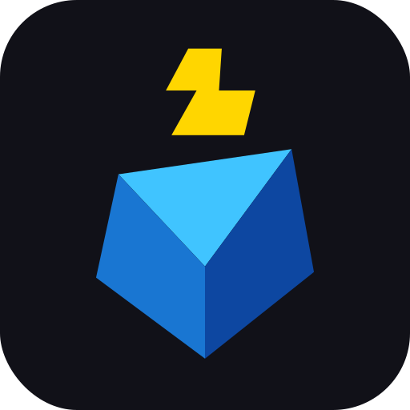
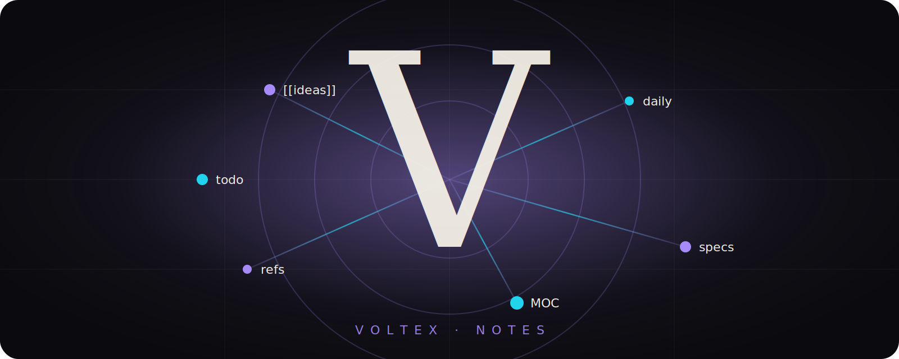

<div align="center">



# Voltex Notes

**A modern, open‑source knowledge base.**
Markdown · Bidirectional links · Graph view · Real‑time sync.

<p>
  <a href="https://voltex.devlune.in"></a>
  <a href="https://github.com/Dev-Lune/voltex-notes/releases/latest"></a>
  
  
  
  
</p>

<a href="https://voltex.devlune.in/notes"><b>Open Web App →</b></a> &nbsp;·&nbsp;
<a href="https://github.com/Dev-Lune/voltex-notes/releases/latest"><b>Download for Windows →</b></a>

</div>

<br/>

<!-- ──────────────────────────────  STAGE  ────────────────────────────── -->
<div align="center">
  
</div>

<br/>

## ✦ What it does

> A second brain that runs in your browser **and** on your desktop. Write in markdown, link with `[[wikilinks]]`, see your knowledge as a graph, and sync everything in real time.

|   | Feature | Notes |
|---|---|---|
| ✏️ | **Markdown editor** | Inline editing, split preview, smart lists, frontmatter |
| 🔗 | **Wikilinks & backlinks** | `[[note]]` autocomplete, hover preview, two‑way links |
| 🕸️ | **Graph view** | Force‑directed physics, live simulation |
| ☁️ | **Real‑time sync** | Firestore `onSnapshot`, per‑folder sync, offline‑first |
| 🔐 | **Auth** | Email/password + Google sign‑in |
| 🎨 | **24 themes** | Voltex Dark, Nord, Dracula, Tokyo Night, Catppuccin… |
| 🧩 | **Plugin marketplace** | Excalidraw, Kanban, Mind maps, Git sync, AI |
| 🔗 | **Public share links** | One‑click read‑only URLs |
| 🖥️ | **Desktop app** | Electron build with auto‑updates |
| 📱 | **Mobile** | Responsive, swipe gestures, haptics |

---

## ✦ Quick start

```bash
git clone https://github.com/Dev-Lune/voltex-notes.git
cd voltex-notes
npm install
npm run dev          # → http://localhost:3000
```

The landing page is at `/`, the app at `/notes`.

<details>
<summary><b>Desktop (Electron)</b></summary>

```bash
npm run electron:dev       # dev mode (Next.js + Electron)
npm run electron:build     # build .exe installer locally
npm run electron:publish   # build + push to GitHub Releases
```

See [docs/RELEASE.md](docs/RELEASE.md).

</details>

<details>
<summary><b>Firebase (optional — required for sync & auth)</b></summary>

1. Create a project at [console.firebase.google.com](https://console.firebase.google.com)
2. Enable **Auth** (Email/Password + Google) and **Firestore**
3. Deploy rules: `firebase deploy --only firestore:rules`
4. `cp .env.example .env.local` and paste your web app config

| Variable | Description |
|---|---|
| `NEXT_PUBLIC_FIREBASE_API_KEY` | Web API key |
| `NEXT_PUBLIC_FIREBASE_AUTH_DOMAIN` | `<project>.firebaseapp.com` |
| `NEXT_PUBLIC_FIREBASE_PROJECT_ID` | Project ID |
| `NEXT_PUBLIC_FIREBASE_STORAGE_BUCKET` | `<project>.appspot.com` |
| `NEXT_PUBLIC_FIREBASE_MESSAGING_SENDER_ID` | Sender ID |
| `NEXT_PUBLIC_FIREBASE_APP_ID` | App ID |

The app works fully offline without Firebase — cloud features just stay dormant.

</details>

---

## ✦ Stack

`Next.js 16` · `React 19` · `TypeScript` · `Tailwind 4` · `Radix + shadcn/ui` · `Lucide` · `Firebase (Auth + Firestore)` · `Electron`

---

## ✦ Shortcuts

`Ctrl+N` new · `Ctrl+P` palette · `Ctrl+E` edit/preview · `Ctrl+F` find · `Ctrl+G` graph · `Ctrl+B` bold · `Ctrl+I` italic · `[[ ]]` link

---

## ✦ Project layout

```
app/                Next.js routes (/, /notes, /share/[id], /api)
components/
 ├─ obsidian/       Core app — ObsidianApp, Editor, Sidebar, GraphView…
 ├─ marketing/      Landing‑page visuals (VoltexStage)
 └─ ui/             shadcn primitives
electron/           Electron main + preload
lib/firebase/       Auth, Firestore sync, offline fallback
lib/marketplace/    Plugin registry
```

---

## ✦ Contributing

PRs welcome. Fork → branch → commit (`feat:` / `fix:` / `refactor:`) → PR.
See [CONTRIBUTING.md](CONTRIBUTING.md) and [CLAUDE.md](CLAUDE.md) for architecture notes.

---

<div align="center">

**MIT** · Inspired by [Obsidian](https://obsidian.md)

<br/>

<a href="https://devlune.in">
  
</a>

<sub><i>voltage + vortex — where sparks spiral.</i></sub>

</div>